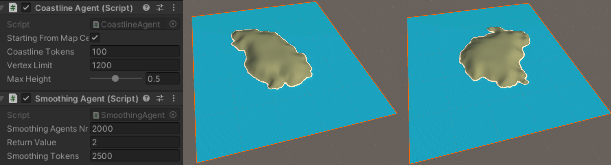
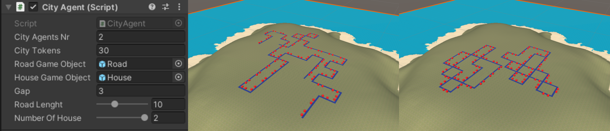
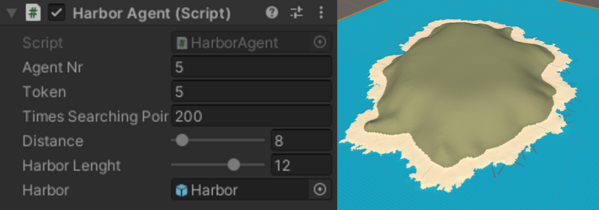
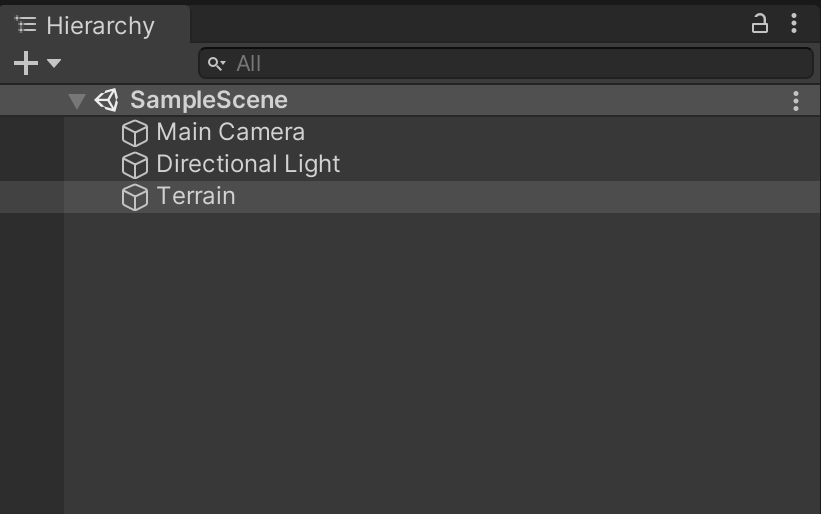
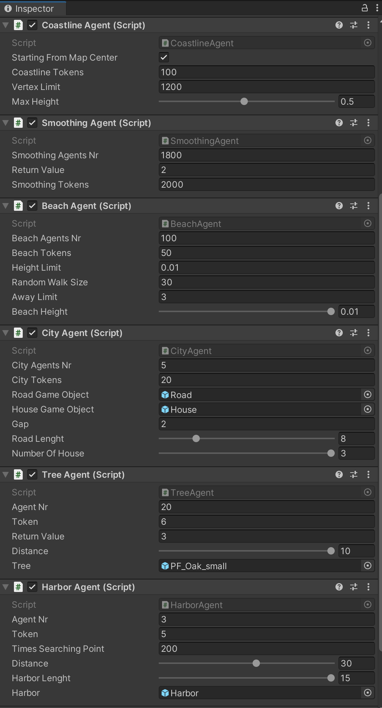

# Controlled procedural terrain generation

This project is developed for the course of Artificial Intelligence for videogames at university of Milan. 

Procedural content generation (PCG) help designer to create content or create it on the fly, since content creation require a lot of times and resources.

This project has the purpose to procedurally generate a coastline environment, adding some details, like house, street, trees and harbor using software agents.
It is an entity placed on the map capable of understanding the surrounding world taking decision based on that, related to the work it was meant to do.

This project was created starting from the work done by [Jonathon Doran and Ian Parberry](https://ieeexplore.ieee.org/document/5454273) who developed a tools capable of create a complete world made up of coastline, beach, mountains and so on, using software agents.

## The project in a nutshell

In order to create a coastline environment as previous said, the following agents are used: 
* __Coastline agent__ : At beginning there is a big ocean, so all the map points are sea points whose height is 0. This agent works consist of elevating a number of vertices related to the parameter specified by the designer.
* __Smoothing agent__ : The point heights previously generated by the coastline agents are not related to each other, so the smoothing agent smooth the point heights according to a suitable neighborhood called extended Von Neumann neighborhood.
* __Beach agent__ : It generate beach according to the parameter specified by the designer.
* __City agent__ : It is responsible to create roads and houses on the coastline previously created by other agents. This agent can work only if the landmass generated is quite flat.
* __Tree agent__ : Tree agent works for placing tree on the landmass. In order to do that the landmass have to be quite flat and the point considered have not to be too steep.
* __Harbor agent__ : This agent place harbors all around the coastline according to parameters chosen. The harbors are placed at boundary between sea points and beach point.

Detailed information about every single agent and the related parameter which is possible to modify, can be found in the [document](Document/Document.pdf) inside the repository.

## Results

The following images show with the related parameter of the coastline and smoothing agent which result it is possible to achieve : 

The following is related to the beach agent : 

City agent : for representing house and road different placeholders are used.

Tree agent :

Harbor agent: like city agent even here a placeholder is used for representing harbor.

## Usage

The project was built with unity editor version 2020.3.20f1 but recently it is updated to the version 2021.3.19f1 so it is recommended to use it. 

Once opened it is necessary to open the scene at `Assets/Scenes/SampleScene.unity` and select the component __Terrain__ within the hierarchy that appears as follows:

Once the Terrain is selected, inside the inspector it is possible to see all the script attached which are all the agents, where it is possible to adjust their parameters :

When all the parameters are set up then it is possible to press the play button in unity in order to see the coastline environment being procedurally generated.

In order to understand the meaning of all the parameters of each agent it is recommended to read the [document](Document/Document.pdf) inside the repository.

---

 

